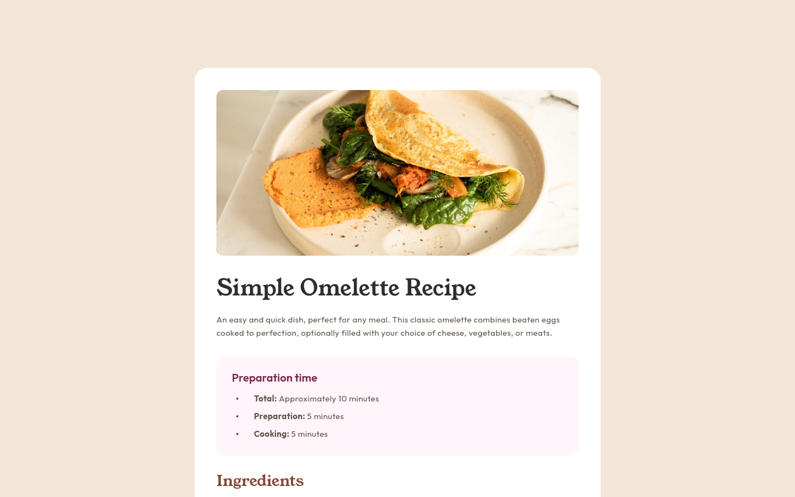

# Frontend Mentor - Recipe page solution

This is a solution to the [Recipe page challenge on Frontend Mentor](https://www.frontendmentor.io/challenges/recipe-page-KiTsR8QQKm). Frontend Mentor challenges help you improve your coding skills by building realistic projects.

## Table of contents

- [Overview](#overview)
  - [The challenge](#the-challenge)
  - [Screenshot](#screenshot)
  - [Links](#links)
- [My process](#my-process)
  - [Built with](#built-with)
  - [Useful resources](#useful-resources)
- [Author](#author)

## Overview

### Screenshot

### Links

- Solution URL: https://www.frontendmentor.io/solutions/recipe-page-using-html-bootstrap-and-alpinejs-IBJ07yDCrR
- Live Site URL: https://joshjavier.github.io/recipe-page/

## My process

### Built with

- Semantic HTML5 markup
- CSS custom properties
- [Bootstrap](https://getbootstrap.com/)
- [Alpine.js](https://alpinejs.dev/)

### Useful resources

- [Prototyping with Vue.js and Bootstrap](https://peterxjang.com/blog/prototyping-with-vuejs-and-bootstrap.html) - This article is what got me back to practicing a no-build approach and realizing its merits, especially for simple projects like this.

## Author

- Website - [Josh Javier](https://joshjavier.com/)
- Frontend Mentor - [@joshjavier](https://www.frontendmentor.io/profile/joshjavier)
